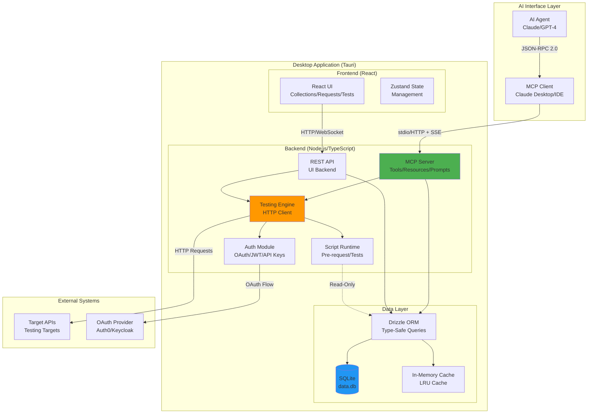
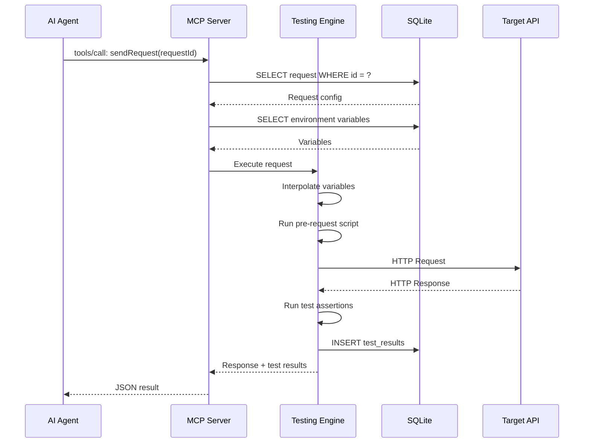
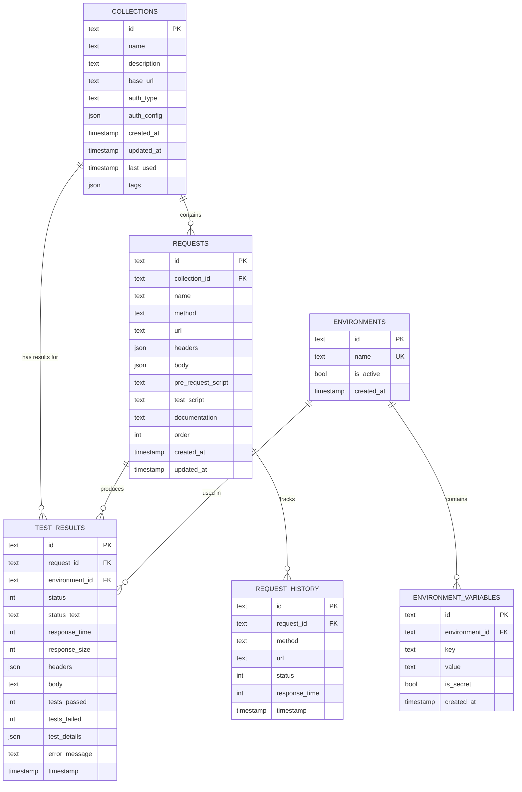
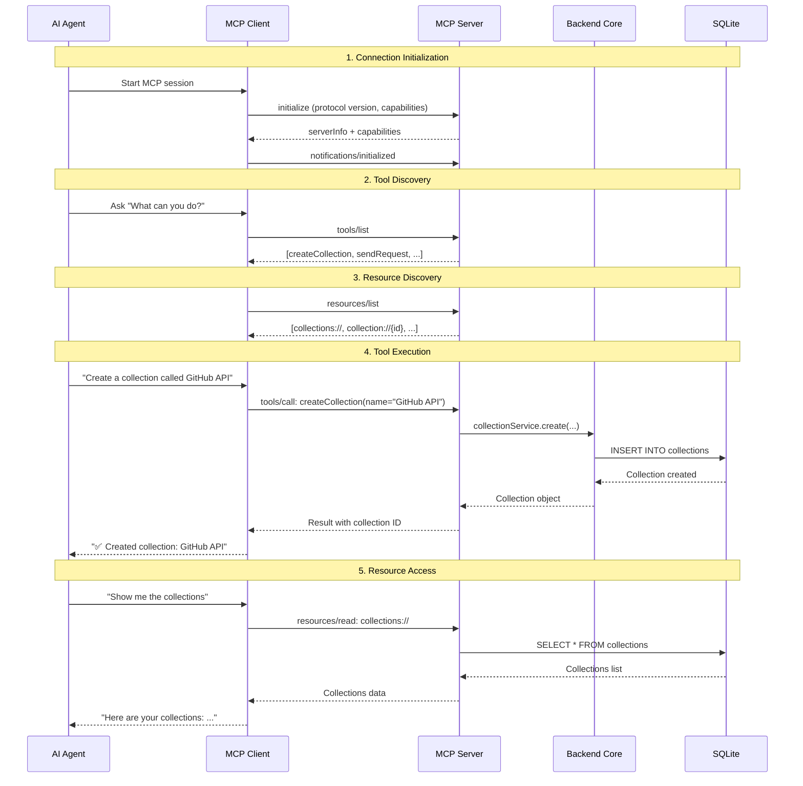
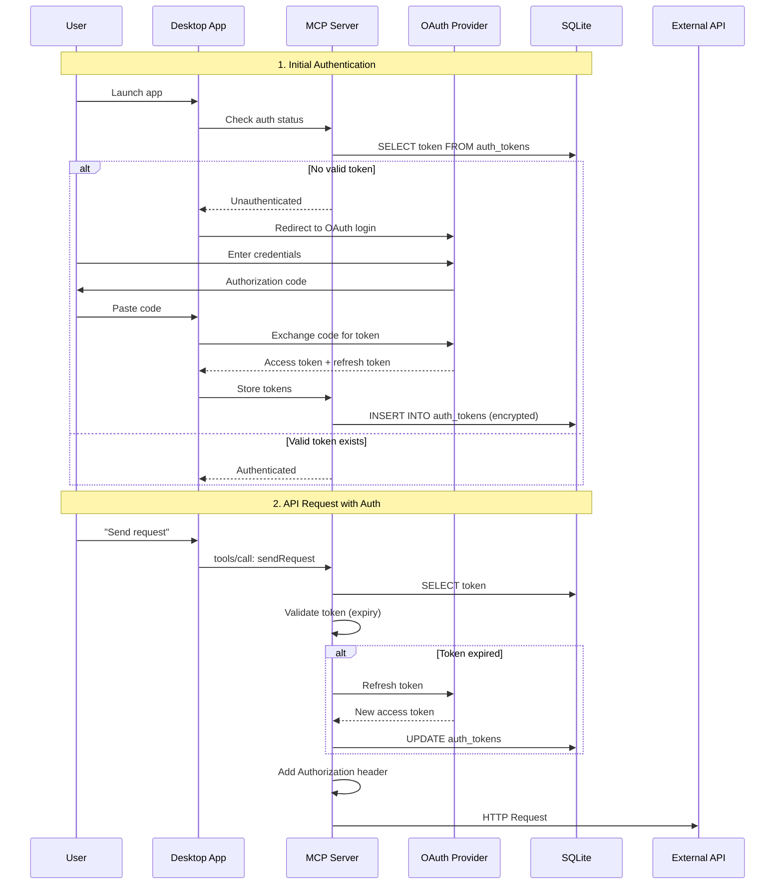

# Architecture Draft
## AI-First API Testing Tool

**Date:** March 5, 2026  
**Version:** 1.0  
**Status:** Draft for Review

---

## System Overview

This architecture describes a **local-first, AI-native API testing tool** where the Model Context Protocol (MCP) is the PRIMARY interface. The tool inverts the traditional paradigm: instead of adding AI features to a GUI app, we build an MCP-first system with a minimal UI for human oversight.

### Core Principles

1. **MCP-First Design** - AI agents are first-class users, UI is secondary
2. **Local-First Storage** - All data on user's machine (SQLite), works offline
3. **Desktop-Native** - Small bundle size (Tauri), low resource usage
4. **Type-Safe** - TypeScript full-stack, shared types between components
5. **Scalable by Design** - Handles 1000+ collections efficiently

### High-Level Architecture



### Data Flow: AI Sends Request



### Component Breakdown

| Component | Technology | Purpose | Lines of Code (est.) |
|-----------|-----------|---------|---------------------|
| MCP Server | Node.js + MCP SDK | AI interface | 2,000 |
| REST API | Express.js | UI backend | 1,500 |
| Testing Engine | Axios + VM2 | Request execution | 1,200 |
| Script Runtime | VM2 (sandboxed JS) | Pre-request/tests | 800 |
| Database Layer | Drizzle ORM + SQLite | Data persistence | 1,000 |
| React UI | React 18 + Tailwind | Human interface | 3,500 |
| Tauri Shell | Rust + Tauri 2.0 | Desktop wrapper | 500 |
| **Total** | | | **~10,500** |

---

## Components

### MCP Server

**Purpose:** Primary interface for AI agents. Exposes tools, resources, and prompts via Model Context Protocol.

**Technology:**
- Node.js 18+ (TypeScript)
- `@modelcontextprotocol/sdk` (TypeScript SDK)
- JSON-RPC 2.0 over stdio/HTTP
- Server-Sent Events (SSE) for streaming

**Responsibilities:**
- Handle MCP tool calls (`createCollection`, `sendRequest`, etc.)
- Expose resources (`collections://`, `request://{id}`)
- Manage prompts (debug-api-endpoint, create-test-suite)
- Validate input schemas (JSON Schema)
- Rate limiting (100 calls/min per user)
- Audit logging (every tool call)
- OAuth 2.1 authentication
- Session management (track MCP sessions)

**Key Interfaces:**

```typescript
// MCP Tools Interface
interface MCPTools {
  // Collection Management
  createCollection(args: CreateCollectionArgs): Promise<Collection>;
  listCollections(args: ListArgs): Promise<CollectionList>;
  deleteCollection(args: DeleteArgs): Promise<DeleteResult>;
  
  // Request Operations
  createRequest(args: CreateRequestArgs): Promise<Request>;
  sendRequest(args: SendRequestArgs): Promise<RequestResult>;
  updateRequest(args: UpdateRequestArgs): Promise<Request>;
  
  // Environment Management
  createEnvironment(args: CreateEnvArgs): Promise<Environment>;
  setVariable(args: SetVarArgs): Promise<void>;
  getVariable(args: GetVarArgs): Promise<Variable>;
  
  // Testing
  generateTests(args: GenTestsArgs): Promise<TestSuggestion[]>;
  runTests(args: RunTestsArgs): Promise<TestResults>;
  runCollection(args: RunCollectionArgs): Promise<CollectionRunResult>;
  
  // Import/Export
  importCollection(args: ImportArgs): Promise<ImportResult>;
  exportCollection(args: ExportArgs): Promise<ExportData>;
}

// MCP Resources Interface
interface MCPResources {
  "collections://": CollectionMetadata[];
  "collection://{id}": CollectionDetail;
  "request://{id}": RequestDetail;
  "environment://{name}": EnvironmentData;
  "testResults://{runId}": TestRunHistory;
}
```

**Performance Targets:**
- Tool call latency: <200ms (non-network operations)
- Resource fetch: <100ms (cached metadata)
- Concurrent sessions: 10+ per user
- Memory per session: <10 MB

**Security:**
- OAuth 2.1 token validation on every call
- Scope-based authorization (collections:read, requests:execute, etc.)
- Input sanitization (prevent SQL injection, XSS)
- Secrets encrypted at rest, never returned via resources
- Audit log: userId, sessionId, tool, args, result, timestamp

---

### Backend Core

**Purpose:** Shared business logic layer used by both MCP Server and REST API.

**Technology:**
- TypeScript (shared with frontend)
- Drizzle ORM for database access
- Zod for runtime validation
- Winston for structured logging

**Responsibilities:**
- CRUD operations (collections, requests, environments)
- Variable interpolation (`{{VAR}}` → resolved value)
- Test execution orchestration
- Import/export logic (OpenAPI, Insomnia, various formats)
- Secret encryption/decryption (AES-256-GCM)
- Database migrations
- Request history management
- Search and filtering logic

**Service Layer:**

```typescript
// Core Services
class CollectionService {
  async create(data: CreateCollectionData): Promise<Collection>;
  async list(filters: ListFilters, pagination: Pagination): Promise<CollectionList>;
  async get(id: string): Promise<Collection | null>;
  async update(id: string, updates: Partial<Collection>): Promise<Collection>;
  async delete(id: string): Promise<void>;
  async search(query: string): Promise<Collection[]>;
}

class RequestService {
  async create(collectionId: string, data: CreateRequestData): Promise<Request>;
  async execute(id: string, env: string, overrides?: Record<string, any>): Promise<ExecutionResult>;
  async duplicate(id: string): Promise<Request>;
  async reorder(collectionId: string, order: string[]): Promise<void>;
}

class EnvironmentService {
  async create(name: string, variables: Record<string, string>): Promise<Environment>;
  async setVariable(envName: string, key: string, value: string, isSecret: boolean): Promise<void>;
  async getVariable(envName: string, key: string): Promise<Variable>;
  async resolveVariables(env: string, template: string): Promise<string>;
}

class TestingService {
  async runTests(requestId: string, env: string): Promise<TestResults>;
  async runCollection(collectionId: string, options: RunOptions): Promise<CollectionRunResult>;
  async generateTests(requestId: string, types: TestType[]): Promise<TestSuggestion[]>;
}

class ImportService {
  async importPostman(json: PostmanCollection): Promise<ImportResult>;
  async importOpenAPI(spec: OpenAPISpec): Promise<ImportResult>;
  async importInsomnia(json: InsomniaExport): Promise<ImportResult>;
  async importCurl(curlCommand: string): Promise<Request>;
}
```

**Error Handling:**

```typescript
// Custom error types
class AppError extends Error {
  constructor(
    public code: string,
    public statusCode: number,
    message: string,
    public metadata?: Record<string, any>
  ) {
    super(message);
  }
}

class NotFoundError extends AppError {
  constructor(resource: string, id: string) {
    super('NOT_FOUND', 404, `${resource} with id ${id} not found`);
  }
}

class ValidationError extends AppError {
  constructor(field: string, message: string) {
    super('VALIDATION_ERROR', 400, message, { field });
  }
}

class RateLimitError extends AppError {
  constructor(retryAfter: number) {
    super('RATE_LIMIT_EXCEEDED', 429, 'Too many requests', { retryAfter });
  }
}
```

---

### Database Layer

**Purpose:** Type-safe data access and persistence using SQLite.

**Technology:**
- SQLite 3.40+ with JSON1 extension
- Drizzle ORM (type-safe queries)
- better-sqlite3 (Node.js driver)
- Write-Ahead Logging (WAL) mode for concurrency

**Schema Design:**

```typescript
// collections table
export const collections = sqliteTable('collections', {
  id: text('id').primaryKey().$defaultFn(() => randomUUID()),
  name: text('name').notNull(),
  description: text('description'),
  baseUrl: text('base_url'),
  authType: text('auth_type', { enum: ['none', 'apikey', 'bearer', 'oauth2', 'basic'] })
    .default('none'),
  authConfig: text('auth_config', { mode: 'json' }).$type<AuthConfig>(),
  createdAt: integer('created_at', { mode: 'timestamp' }).notNull().$defaultFn(() => new Date()),
  updatedAt: integer('updated_at', { mode: 'timestamp' }).notNull().$defaultFn(() => new Date()),
  lastUsed: integer('last_used', { mode: 'timestamp' }),
  tags: text('tags', { mode: 'json' }).$type<string[]>(),
});

// requests table
export const requests = sqliteTable('requests', {
  id: text('id').primaryKey().$defaultFn(() => randomUUID()),
  collectionId: text('collection_id').notNull().references(() => collections.id, { onDelete: 'cascade' }),
  name: text('name').notNull(),
  method: text('method', { enum: ['GET', 'POST', 'PUT', 'PATCH', 'DELETE', 'HEAD', 'OPTIONS'] })
    .notNull(),
  url: text('url').notNull(),
  headers: text('headers', { mode: 'json' }).$type<Record<string, string>>(),
  body: text('body', { mode: 'json' }).$type<RequestBody>(),
  preRequestScript: text('pre_request_script'),
  testScript: text('test_script'),
  documentation: text('documentation'),
  order: integer('order').notNull().default(0),
  createdAt: integer('created_at', { mode: 'timestamp' }).notNull().$defaultFn(() => new Date()),
  updatedAt: integer('updated_at', { mode: 'timestamp' }).notNull().$defaultFn(() => new Date()),
});

// environments table
export const environments = sqliteTable('environments', {
  id: text('id').primaryKey().$defaultFn(() => randomUUID()),
  name: text('name').notNull().unique(),
  isActive: integer('is_active', { mode: 'boolean' }).default(false),
  createdAt: integer('created_at', { mode: 'timestamp' }).notNull().$defaultFn(() => new Date()),
});

// environment_variables table
export const environmentVariables = sqliteTable('environment_variables', {
  id: text('id').primaryKey().$defaultFn(() => randomUUID()),
  environmentId: text('environment_id').notNull().references(() => environments.id, { onDelete: 'cascade' }),
  key: text('key').notNull(),
  value: text('value').notNull(), // Encrypted if isSecret=true
  isSecret: integer('is_secret', { mode: 'boolean' }).default(false),
  createdAt: integer('created_at', { mode: 'timestamp' }).notNull().$defaultFn(() => new Date()),
}, (table) => ({
  uniqEnvKey: unique().on(table.environmentId, table.key),
}));

// test_results table
export const testResults = sqliteTable('test_results', {
  id: text('id').primaryKey().$defaultFn(() => randomUUID()),
  requestId: text('request_id').notNull().references(() => requests.id, { onDelete: 'cascade' }),
  environmentId: text('environment_id').references(() => environments.id),
  status: integer('status').notNull(),
  statusText: text('status_text').notNull(),
  responseTime: integer('response_time').notNull(), // milliseconds
  responseSize: integer('response_size').notNull(), // bytes
  headers: text('headers', { mode: 'json' }).$type<Record<string, string>>(),
  body: text('body'), // Truncated or compressed for large responses
  testsPassed: integer('tests_passed').notNull().default(0),
  testsFailed: integer('tests_failed').notNull().default(0),
  testDetails: text('test_details', { mode: 'json' }).$type<TestDetail[]>(),
  errorMessage: text('error_message'),
  timestamp: integer('timestamp', { mode: 'timestamp' }).notNull().$defaultFn(() => new Date()),
});

// request_history table (lightweight tracking)
export const requestHistory = sqliteTable('request_history', {
  id: text('id').primaryKey().$defaultFn(() => randomUUID()),
  requestId: text('request_id').references(() => requests.id, { onDelete: 'set null' }),
  method: text('method').notNull(),
  url: text('url').notNull(),
  status: integer('status'),
  responseTime: integer('response_time'),
  timestamp: integer('timestamp', { mode: 'timestamp' }).notNull().$defaultFn(() => new Date()),
});

// Indexes for performance
export const collectionsIndexes = {
  nameIndex: index('collections_name_idx').on(collections.name),
  lastUsedIndex: index('collections_last_used_idx').on(collections.lastUsed),
};

export const requestsIndexes = {
  collectionIndex: index('requests_collection_id_idx').on(requests.collectionId),
  orderIndex: index('requests_order_idx').on(requests.order),
};

export const testResultsIndexes = {
  requestIndex: index('test_results_request_id_idx').on(testResults.requestId),
  timestampIndex: index('test_results_timestamp_idx').on(testResults.timestamp),
};
```

**Migrations:**

```typescript
// migrations/0001_init.sql
CREATE TABLE collections (
  id TEXT PRIMARY KEY,
  name TEXT NOT NULL,
  description TEXT,
  base_url TEXT,
  auth_type TEXT DEFAULT 'none',
  auth_config TEXT, -- JSON
  created_at INTEGER NOT NULL,
  updated_at INTEGER NOT NULL,
  last_used INTEGER,
  tags TEXT -- JSON array
);

CREATE INDEX collections_name_idx ON collections(name);
CREATE INDEX collections_last_used_idx ON collections(last_used);

-- ... (other tables follow similar pattern)
```

**Performance Optimizations:**
- WAL mode: `PRAGMA journal_mode = WAL;`
- Memory-mapped I/O: `PRAGMA mmap_size = 30000000000;`
- Connection pooling: 5 read connections, 1 write connection
- Query result caching (LRU cache, 5-minute TTL)
- Prepared statements for common queries
- Batch inserts for test results (up to 100 at once)

---

### Desktop UI

**Purpose:** Human oversight, debugging, and visual configuration. Secondary to MCP interface.

**Technology:**
- Tauri 2.0 (Rust backend, OS webview)
- React 18 + TypeScript
- Tailwind CSS 3.4 (styling)
- Zustand (state management)
- React Query (server state)
- React Router (navigation)

**Responsibilities:**
- Display collections, requests, environments
- Request builder form (method, URL, headers, body)
- Response viewer (formatted JSON, HTML, XML)
- Test results visualization
- Environment switcher
- Settings management (theme, timeout, SSL verification)
- Import/export UI
- Request history browser

**Component Structure:**

```typescript
// App structure
src/
├── components/
│   ├── collections/
│   │   ├── CollectionTree.tsx       // Sidebar tree view
│   │   ├── CollectionItem.tsx       // Individual collection
│   │   └── CreateCollectionModal.tsx
│   ├── requests/
│   │   ├── RequestBuilder.tsx       // Main request form
│   │   ├── RequestTabs.tsx          // Params/Headers/Body/Tests
│   │   ├── MethodSelector.tsx       // GET/POST/etc dropdown
│   │   ├── URLInput.tsx             // URL with variable highlighting
│   │   └── BodyEditor.tsx           // JSON/Form/Raw editors
│   ├── responses/
│   │   ├── ResponseViewer.tsx       // Main response display
│   │   ├── ResponseTabs.tsx         // Body/Headers/Cookies/Tests
│   │   ├── JSONViewer.tsx           // Formatted JSON with syntax highlighting
│   │   └── TestResults.tsx          // Pass/fail test summary
│   ├── environments/
│   │   ├── EnvironmentSwitcher.tsx  // Dropdown in header
│   │   ├── EnvironmentEditor.tsx    // Variable table
│   │   └── VariableInput.tsx        // Key/value pairs
│   ├── tests/
│   │   ├── TestEditor.tsx           // Test script editor (Monaco)
│   │   ├── TestSnippets.tsx         // Pre-built test templates
│   │   └── TestResultsPanel.tsx     // Detailed pass/fail
│   ├── history/
│   │   ├── HistoryPanel.tsx         // Request history list
│   │   └── HistoryItem.tsx          // Individual history entry
│   └── shared/
│       ├── Button.tsx
│       ├── Input.tsx
│       ├── Modal.tsx
│       ├── Tabs.tsx
│       └── CodeEditor.tsx           // Monaco wrapper
├── pages/
│   ├── Main.tsx                     // Main app layout
│   ├── Settings.tsx                 // Settings page
│   └── Import.tsx                   // Import wizard
├── stores/
│   ├── useCollectionsStore.ts       // Zustand store
│   ├── useRequestsStore.ts
│   └── useUIStore.ts
├── hooks/
│   ├── useCollections.ts            // React Query hooks
│   ├── useRequests.ts
│   └── useEnvironments.ts
├── services/
│   ├── api.ts                       // REST API client
│   └── ipc.ts                       // Tauri IPC commands
└── App.tsx
```

**State Management Strategy:**

```typescript
// Zustand store for UI state
interface UIStore {
  // Current selections
  activeCollectionId: string | null;
  activeRequestId: string | null;
  activeEnvironment: string;
  
  // UI state
  sidebarCollapsed: boolean;
  theme: 'light' | 'dark';
  activeTab: 'params' | 'headers' | 'body' | 'tests';
  
  // Actions
  setActiveCollection: (id: string) => void;
  setActiveRequest: (id: string) => void;
  setActiveEnvironment: (name: string) => void;
  toggleSidebar: () => void;
}

// React Query for server state
const useCollections = () => {
  return useQuery({
    queryKey: ['collections'],
    queryFn: async () => {
      const response = await fetch('/api/collections');
      return response.json();
    },
    staleTime: 5 * 60 * 1000, // 5 minutes
  });
};

const useSendRequest = () => {
  return useMutation({
    mutationFn: async (requestId: string) => {
      const response = await fetch(`/api/requests/${requestId}/send`, {
        method: 'POST',
      });
      return response.json();
    },
    onSuccess: (data) => {
      // Update history, show response
    },
  });
};
```

**IPC Communication (Tauri):**

```typescript
// Frontend → Tauri backend
import { invoke } from '@tauri-apps/api/tauri';

// Invoke Rust commands from React
const sendRequest = async (requestId: string) => {
  const result = await invoke<RequestResult>('send_request', {
    requestId,
    environment: 'default',
  });
  return result;
};

// Listen to backend events
import { listen } from '@tauri-apps/api/event';

listen<TestProgress>('test-progress', (event) => {
  console.log(`Progress: ${event.payload.current}/${event.payload.total}`);
});
```

**Styling Approach:**

```tsx
// Tailwind utility-first CSS
const RequestBuilder = () => {
  return (
    <div className="flex flex-col h-full bg-white dark:bg-gray-900">
      <div className="flex items-center gap-2 p-4 border-b border-gray-200 dark:border-gray-700">
        <select className="px-3 py-2 rounded-md bg-gray-100 dark:bg-gray-800">
          <option>GET</option>
          <option>POST</option>
        </select>
        <input
          type="text"
          placeholder="https://api.example.com/endpoint"
          className="flex-1 px-3 py-2 rounded-md border border-gray-300 dark:border-gray-600"
        />
        <button className="px-4 py-2 bg-blue-600 text-white rounded-md hover:bg-blue-700">
          Send
        </button>
      </div>
      {/* ... */}
    </div>
  );
};
```

**Performance Targets:**
- Initial render: <100ms
- Route transition: <50ms
- Large collection (1000 items) render: <500ms (virtualized)
- Syntax highlighting: <16ms (60 FPS)

---

### Testing Engine

**Purpose:** Execute HTTP requests with variable interpolation, pre-request scripts, and test assertions.

**Technology:**
- Axios (HTTP client)
- VM2 (sandboxed JavaScript execution)
- Chai.js (assertion library)
- Cookie jar (automatic cookie management)
- Follow-redirects support

**Responsibilities:**
- Resolve environment variables (`{{VAR}}` → value)
- Execute pre-request scripts (modify request before sending)
- Send HTTP requests (all methods, custom headers, various body types)
- Handle authentication (API key, Bearer, Basic, OAuth)
- Execute test scripts (validate responses)
- Track response time, size, status
- Store results in database
- Emit progress events (for UI/MCP)

**Execution Flow:**

```typescript
class TestingEngine {
  async executeRequest(
    request: Request,
    environment: Environment,
    overrides?: Partial<Request>
  ): Promise<ExecutionResult> {
    // 1. Merge overrides
    const finalRequest = { ...request, ...overrides };
    
    // 2. Resolve variables
    const resolvedUrl = await this.resolveVariables(finalRequest.url, environment);
    const resolvedHeaders = await this.resolveHeaders(finalRequest.headers, environment);
    const resolvedBody = await this.resolveBody(finalRequest.body, environment);
    
    // 3. Execute pre-request script
    const scriptContext = this.createScriptContext(environment);
    if (finalRequest.preRequestScript) {
      await this.executeScript(finalRequest.preRequestScript, scriptContext);
      // Script can modify scriptContext.request
    }
    
    // 4. Apply authentication
    const authenticatedRequest = await this.applyAuth(
      { url: resolvedUrl, headers: resolvedHeaders, body: resolvedBody },
      request.authConfig
    );
    
    // 5. Send HTTP request
    const startTime = Date.now();
    let response: AxiosResponse;
    try {
      response = await axios({
        method: finalRequest.method,
        url: authenticatedRequest.url,
        headers: authenticatedRequest.headers,
        data: authenticatedRequest.body,
        timeout: 30000,
        maxRedirects: 5,
        validateStatus: () => true, // Don't throw on non-2xx
      });
    } catch (error) {
      return {
        success: false,
        error: error.message,
        responseTime: Date.now() - startTime,
      };
    }
    const responseTime = Date.now() - startTime;
    
    // 6. Execute test script
    scriptContext.response = {
      status: response.status,
      headers: response.headers,
      body: response.data,
      responseTime,
    };
    
    let testResults: TestResult[] = [];
    if (finalRequest.testScript) {
      testResults = await this.executeTestScript(finalRequest.testScript, scriptContext);
    }
    
    // 7. Store results
    await this.storeResult({
      requestId: request.id,
      environmentId: environment.id,
      status: response.status,
      statusText: response.statusText,
      responseTime,
      responseSize: JSON.stringify(response.data).length,
      headers: response.headers,
      body: response.data,
      testResults,
    });
    
    // 8. Return result
    return {
      success: true,
      status: response.status,
      statusText: response.statusText,
      headers: response.headers,
      body: response.data,
      responseTime,
      responseSize: JSON.stringify(response.data).length,
      testResults,
    };
  }
  
  private createScriptContext(environment: Environment): ScriptContext {
    return {
      // Pre-request scripts can modify this
      request: {
        url: '',
        headers: {},
        body: null,
      },
      // Test scripts read this
      response: null as any,
      // Utilities available in scripts
      pm: {
        environment: {
          get: (key: string) => environment.variables[key],
          set: (key: string, value: string) => {
            environment.variables[key] = value;
          },
        },
        variables: {
          get: (key: string) => environment.variables[key],
          set: (key: string, value: string) => {
            environment.variables[key] = value;
          },
        },
        test: (name: string, fn: () => void) => {
          // Register test assertion
        },
        expect: chai.expect,
      },
    };
  }
  
  private async executeScript(script: string, context: ScriptContext): Promise<void> {
    const vm = new VM2({
      timeout: 5000, // 5 second timeout
      sandbox: context,
    });
    
    try {
      vm.run(script);
    } catch (error) {
      throw new ScriptError(`Script execution failed: ${error.message}`);
    }
  }
  
  private async resolveVariables(template: string, env: Environment): Promise<string> {
    // Replace {{VAR}} with env.variables[VAR]
    return template.replace(/\{\{(\w+)\}\}/g, (match, varName) => {
      return env.variables[varName] || match;
    });
  }
}
```

**Script Sandbox API:**

```javascript
// Available in pre-request and test scripts
pm.environment.get('API_KEY'); // Get environment variable
pm.environment.set('TOKEN', 'abc123'); // Set environment variable

pm.variables.get('userId'); // Get local variable
pm.variables.set('userId', '12345'); // Set local variable

// Test assertions (Chai.js)
pm.test('Status is 200', () => {
  pm.expect(pm.response.status).to.equal(200);
});

pm.test('Response has user ID', () => {
  pm.expect(pm.response.body).to.have.property('id');
});

pm.test('Response time is acceptable', () => {
  pm.expect(pm.response.responseTime).to.be.below(1000);
});

// Pre-request script example
const timestamp = Date.now();
pm.environment.set('timestamp', timestamp.toString());
pm.request.headers['X-Timestamp'] = timestamp.toString();
```

**Security Constraints:**
- Scripts run in isolated VM2 sandbox
- No access to Node.js modules (fs, http, etc.)
- No network access (can't make requests)
- 5-second timeout limit
- Memory limit: 128 MB per script
- Can read environment variables (but not secrets directly)
- Can modify request/response, but changes don't persist to database

---

### Script Runtime

**Purpose:** Secure JavaScript execution environment for pre-request and test scripts.

**Technology:**
- VM2 (Node.js sandbox)
- Chai.js (BDD/TDD assertion library)
- Custom `pm` API (industry-standard scripting API)

**Responsibilities:**
- Execute user-provided JavaScript safely
- Provide `pm` API for scripts
- Enforce timeouts (5 seconds)
- Limit memory usage (128 MB)
- Isolate from Node.js internals
- Collect test results (pass/fail)
- Handle script errors gracefully

**API Surface:**

```typescript
// pm.* API exposed to scripts
interface PMApi {
  // Environment access
  environment: {
    get(key: string): string | undefined;
    set(key: string, value: string): void;
  };
  
  // Variables (scoped to request)
  variables: {
    get(key: string): string | undefined;
    set(key: string, value: string): void;
  };
  
  // Request object (modifiable in pre-request scripts)
  request: {
    url: string;
    method: string;
    headers: Record<string, string>;
    body: any;
  };
  
  // Response object (available in test scripts)
  response: {
    status: number;
    statusText: string;
    headers: Record<string, string>;
    body: any;
    responseTime: number;
    responseSize: number;
  };
  
  // Test registration
  test(name: string, testFn: () => void): void;
  
  // Assertions (Chai.js)
  expect: Chai.ExpectStatic;
}
```

**Implementation:**

```typescript
class ScriptRuntime {
  private tests: TestResult[] = [];
  
  async executePreRequestScript(
    script: string,
    context: RequestContext
  ): Promise<RequestContext> {
    const sandbox = this.createSandbox(context);
    
    const vm = new VM2({
      timeout: 5000,
      sandbox,
      eval: false,
      wasm: false,
    });
    
    try {
      vm.run(script);
      // Script may have modified sandbox.pm.request
      return {
        ...context,
        request: sandbox.pm.request,
        environment: sandbox.pm.environment._data,
      };
    } catch (error) {
      throw new ScriptError(`Pre-request script failed: ${error.message}`);
    }
  }
  
  async executeTestScript(
    script: string,
    context: ResponseContext
  ): Promise<TestResult[]> {
    this.tests = [];
    const sandbox = this.createSandbox(context);
    
    // Override pm.test to collect results
    sandbox.pm.test = (name: string, testFn: () => void) => {
      try {
        testFn();
        this.tests.push({ name, passed: true });
      } catch (error) {
        this.tests.push({
          name,
          passed: false,
          message: error.message,
        });
      }
    };
    
    const vm = new VM2({
      timeout: 5000,
      sandbox,
      eval: false,
      wasm: false,
    });
    
    try {
      vm.run(script);
      return this.tests;
    } catch (error) {
      this.tests.push({
        name: 'Script Execution',
        passed: false,
        message: error.message,
      });
      return this.tests;
    }
  }
  
  private createSandbox(context: any): any {
    return {
      console: {
        log: (...args: any[]) => this.logToConsole('log', args),
        error: (...args: any[]) => this.logToConsole('error', args),
      },
      pm: {
        environment: this.createEnvironmentProxy(context.environment),
        variables: this.createVariablesProxy(context.variables),
        request: context.request || {},
        response: context.response || {},
        test: (name: string, fn: () => void) => {
          // Will be overridden in executeTestScript
        },
        expect: chai.expect,
      },
    };
  }
}
```

---

## Data Model

### Entity Relationship Diagram



### Sample Data

```sql
-- Collections
INSERT INTO collections (id, name, base_url, auth_type, created_at, updated_at) VALUES
  ('coll-1', 'GitHub API', 'https://api.github.com', 'bearer', 1709644800, 1709644800),
  ('coll-2', 'Stripe API', 'https://api.stripe.com/v1', 'apikey', 1709644800, 1709644800);

-- Requests
INSERT INTO requests (id, collection_id, name, method, url, headers, created_at, updated_at) VALUES
  ('req-1', 'coll-1', 'Get User', 'GET', '/user', 
   '{"Accept": "application/json"}', 1709644800, 1709644800),
  ('req-2', 'coll-1', 'List Repos', 'GET', '/user/repos',
   '{"Accept": "application/json"}', 1709644800, 1709644800);

-- Environments
INSERT INTO environments (id, name, is_active, created_at) VALUES
  ('env-1', 'development', true, 1709644800),
  ('env-2', 'production', false, 1709644800);

-- Environment Variables
INSERT INTO environment_variables (id, environment_id, key, value, is_secret, created_at) VALUES
  ('var-1', 'env-1', 'API_URL', 'https://api.dev.example.com', false, 1709644800),
  ('var-2', 'env-1', 'API_KEY', 'encrypted:abc123...', true, 1709644800);
```

---

## Communication Patterns

### MCP Protocol Flow



**Transport Options:**

1. **Stdio (Local):**
   - MCP server runs as child process
   - Communication via stdin/stdout
   - Fast (no network latency)
   - Single client per server

2. **HTTP + SSE (Remote):**
   - MCP server listens on HTTP port
   - Client sends POST requests
   - Server sends events via Server-Sent Events
   - Supports multiple clients
   - Requires authentication (OAuth 2.1)

**Message Format (JSON-RPC 2.0):**

```json
// Request
{
  "jsonrpc": "2.0",
  "id": 1,
  "method": "tools/call",
  "params": {
    "name": "sendRequest",
    "arguments": {
      "requestId": "req-123",
      "environment": "production"
    }
  }
}

// Response
{
  "jsonrpc": "2.0",
  "id": 1,
  "result": {
    "status": 200,
    "body": {"user": "john"},
    "responseTime": 234,
    "testResults": {
      "passed": 2,
      "failed": 0
    }
  }
}

// Error
{
  "jsonrpc": "2.0",
  "id": 1,
  "error": {
    "code": -32602,
    "message": "Invalid params",
    "data": {
      "field": "requestId",
      "error": "Request not found"
    }
  }
}
```

---

### REST API (UI Backend)

**Endpoints:**

```typescript
// Collections
GET    /api/collections              // List all collections
POST   /api/collections              // Create collection
GET    /api/collections/:id          // Get collection details
PUT    /api/collections/:id          // Update collection
DELETE /api/collections/:id          // Delete collection
POST   /api/collections/:id/duplicate // Duplicate collection

// Requests
GET    /api/collections/:id/requests // List requests in collection
POST   /api/collections/:id/requests // Create request
GET    /api/requests/:id             // Get request details
PUT    /api/requests/:id             // Update request
DELETE /api/requests/:id             // Delete request
POST   /api/requests/:id/send        // Execute request
POST   /api/requests/:id/duplicate   // Duplicate request

// Environments
GET    /api/environments             // List environments
POST   /api/environments             // Create environment
GET    /api/environments/:id         // Get environment
PUT    /api/environments/:id         // Update environment
DELETE /api/environments/:id         // Delete environment
PUT    /api/environments/:id/activate // Set as active

// Variables
GET    /api/environments/:id/variables     // List variables
POST   /api/environments/:id/variables     // Create variable
PUT    /api/environments/:id/variables/:key // Update variable
DELETE /api/environments/:id/variables/:key // Delete variable

// Test Results
GET    /api/results                  // List recent results
GET    /api/results/:id              // Get result details
GET    /api/requests/:id/results     // Get results for request

// History
GET    /api/history                  // Get request history
DELETE /api/history                  // Clear history

// Import/Export
POST   /api/import                   // Import collection
GET    /api/collections/:id/export   // Export collection
```

**Response Format:**

```typescript
// Success
{
  "success": true,
  "data": { /* resource data */ }
}

// Error
{
  "success": false,
  "error": {
    "code": "VALIDATION_ERROR",
    "message": "Invalid URL format",
    "field": "url"
  }
}

// List with pagination
{
  "success": true,
  "data": {
    "items": [ /* resources */ ],
    "pagination": {
      "total": 100,
      "page": 1,
      "pageSize": 50,
      "hasMore": true
    }
  }
}
```

---

### WebSocket (Real-Time Updates)

**Purpose:** Real-time progress updates during collection runs, live test results.

**Events:**

```typescript
// Client → Server
{
  "type": "subscribe",
  "channel": "collection-run:abc-123"
}

// Server → Client (progress updates)
{
  "type": "progress",
  "channel": "collection-run:abc-123",
  "data": {
    "current": 5,
    "total": 10,
    "currentRequest": "Get User Profile",
    "passed": 4,
    "failed": 1
  }
}

// Server → Client (completion)
{
  "type": "complete",
  "channel": "collection-run:abc-123",
  "data": {
    "runId": "run-456",
    "duration": 5234,
    "passed": 8,
    "failed": 2
  }
}

// Client → Server (unsubscribe)
{
  "type": "unsubscribe",
  "channel": "collection-run:abc-123"
}
```

**Implementation:**

```typescript
// Server-side (ws library)
import WebSocket from 'ws';

const wss = new WebSocket.Server({ port: 8080 });

wss.on('connection', (ws) => {
  ws.on('message', (message) => {
    const msg = JSON.parse(message);
    if (msg.type === 'subscribe') {
      ws.channel = msg.channel;
    }
  });
});

// Broadcast progress
function broadcastProgress(channel: string, data: any) {
  wss.clients.forEach((client) => {
    if (client.channel === channel && client.readyState === WebSocket.OPEN) {
      client.send(JSON.stringify({ type: 'progress', channel, data }));
    }
  });
}
```

---

## Security Architecture

### Authentication Flow



### OAuth 2.1 Scopes

```typescript
// Scope definitions
const SCOPES = {
  'collections:read': 'View collections and requests',
  'collections:write': 'Create and modify collections',
  'collections:delete': 'Delete collections',
  'requests:execute': 'Send API requests',
  'environments:read': 'View environment variables',
  'environments:write': 'Modify environment variables',
  'results:read': 'View test results',
  'admin:all': 'Full administrative access',
};

// Scope checking middleware
function requireScope(...scopes: string[]) {
  return (req, res, next) => {
    const userScopes = req.user.scopes;
    const hasScope = scopes.some(scope => userScopes.includes(scope));
    if (!hasScope) {
      return res.status(403).json({
        error: 'INSUFFICIENT_PERMISSIONS',
        required: scopes,
        granted: userScopes,
      });
    }
    next();
  };
}

// Usage
app.post('/api/collections', requireScope('collections:write'), async (req, res) => {
  // Create collection
});
```

### Secret Storage

**Environment Variable Encryption:**

```typescript
import crypto from 'crypto';

class SecretManager {
  private algorithm = 'aes-256-gcm';
  private key: Buffer;
  
  constructor() {
    // Derive key from user's master password or OS keychain
    this.key = this.deriveKey();
  }
  
  encrypt(plaintext: string): string {
    const iv = crypto.randomBytes(16);
    const cipher = crypto.createCipheriv(this.algorithm, this.key, iv);
    
    let encrypted = cipher.update(plaintext, 'utf8', 'hex');
    encrypted += cipher.final('hex');
    
    const authTag = cipher.getAuthTag();
    
    // Format: iv:authTag:encrypted
    return `${iv.toString('hex')}:${authTag.toString('hex')}:${encrypted}`;
  }
  
  decrypt(ciphertext: string): string {
    const [ivHex, authTagHex, encrypted] = ciphertext.split(':');
    
    const iv = Buffer.from(ivHex, 'hex');
    const authTag = Buffer.from(authTagHex, 'hex');
    
    const decipher = crypto.createDecipheriv(this.algorithm, this.key, iv);
    decipher.setAuthTag(authTag);
    
    let decrypted = decipher.update(encrypted, 'hex', 'utf8');
    decrypted += decipher.final('utf8');
    
    return decrypted;
  }
  
  private deriveKey(): Buffer {
    // Option 1: OS keychain (macOS Keychain, Windows Credential Manager, Linux Secret Service)
    // Option 2: Master password + PBKDF2
    // Option 3: Hardware security module (future)
    
    // For now, use a key derived from machine ID + user password
    const machineId = os.hostname();
    const userPassword = this.getMasterPassword();
    
    return crypto.pbkdf2Sync(
      userPassword,
      machineId,
      100000, // iterations
      32, // key length
      'sha256'
    );
  }
}
```

### Request Sanitization

**Input Validation:**

```typescript
import { z } from 'zod';

// Zod schemas for validation
const CreateCollectionSchema = z.object({
  name: z.string().min(1).max(255),
  description: z.string().max(1000).optional(),
  baseUrl: z.string().url().optional(),
  authType: z.enum(['none', 'apikey', 'bearer', 'oauth2', 'basic']),
  authConfig: z.record(z.string()).optional(),
});

// Usage
function validateInput<T>(schema: z.ZodSchema<T>, data: unknown): T {
  try {
    return schema.parse(data);
  } catch (error) {
    if (error instanceof z.ZodError) {
      throw new ValidationError(
        error.errors[0].path.join('.'),
        error.errors[0].message
      );
    }
    throw error;
  }
}

// In tool handler
async function createCollection(args: unknown) {
  const validatedArgs = validateInput(CreateCollectionSchema, args);
  // Now validatedArgs is type-safe
  const collection = await db.collections.create(validatedArgs);
  return collection;
}
```

### Audit Logging

**Log Schema:**

```typescript
interface AuditLog {
  id: string;
  timestamp: Date;
  userId: string;
  sessionId: string;
  action: string; // 'tools/call', 'api/request', etc.
  resource: string; // 'collection:abc-123'
  method: string; // 'createCollection', 'sendRequest', etc.
  args: Record<string, any>; // Sanitized (no secrets)
  result: 'success' | 'failure';
  errorMessage?: string;
  ipAddress?: string;
  userAgent?: string;
  duration: number; // milliseconds
}

// Audit logger
class AuditLogger {
  async log(entry: AuditLog) {
    // Store in SQLite
    await db.auditLogs.insert(entry);
    
    // Also write to file for external analysis
    await fs.appendFile(
      './logs/audit.jsonl',
      JSON.stringify(entry) + '\n'
    );
  }
  
  async query(filters: AuditFilters): Promise<AuditLog[]> {
    return db.auditLogs.find(filters);
  }
  
  async detectAnomalies(): Promise<Anomaly[]> {
    // Simple anomaly detection
    const recentLogs = await db.auditLogs.findRecent(3600); // Last hour
    
    const anomalies: Anomaly[] = [];
    
    // Detect: 100+ deletions in 1 hour
    const deletions = recentLogs.filter(log => log.method === 'deleteCollection');
    if (deletions.length > 100) {
      anomalies.push({
        type: 'MASS_DELETION',
        count: deletions.length,
        userId: deletions[0].userId,
      });
    }
    
    // Detect: 1000+ API calls in 1 hour
    const apiCalls = recentLogs.filter(log => log.action === 'tools/call');
    if (apiCalls.length > 1000) {
      anomalies.push({
        type: 'RATE_LIMIT_ABUSE',
        count: apiCalls.length,
        userId: apiCalls[0].userId,
      });
    }
    
    return anomalies;
  }
}
```

### Permission Model

**Role-Based Access (Future Enhancement):**

```typescript
// User roles (Phase 2+)
enum Role {
  VIEWER = 'viewer',       // Read-only
  EDITOR = 'editor',       // Create/edit
  ADMIN = 'admin',         // Full access
}

// Permissions matrix
const PERMISSIONS = {
  [Role.VIEWER]: [
    'collections:read',
    'requests:read',
    'environments:read',
    'results:read',
  ],
  [Role.EDITOR]: [
    'collections:read',
    'collections:write',
    'requests:read',
    'requests:write',
    'requests:execute',
    'environments:read',
    'environments:write',
    'results:read',
  ],
  [Role.ADMIN]: [
    'collections:*',
    'requests:*',
    'environments:*',
    'results:*',
    'users:*',
    'admin:*',
  ],
};
```

---

## Deployment

### Build Process

```yaml
# .github/workflows/release.yml
name: Release

on:
  push:
    tags:
      - 'v*'

jobs:
  build:
    strategy:
      matrix:
        os: [ubuntu-latest, macos-latest, windows-latest]
    runs-on: ${{ matrix.os }}
    
    steps:
      - uses: actions/checkout@v3
      
      - name: Setup Node.js
        uses: actions/setup-node@v3
        with:
          node-version: 18
      
      - name: Setup Rust
        uses: actions-rs/toolchain@v1
        with:
          toolchain: stable
      
      - name: Install pnpm
        uses: pnpm/action-setup@v2
      
      - name: Install dependencies
        run: pnpm install
      
      - name: Run tests
        run: pnpm test
      
      - name: Build Tauri app
        uses: tauri-apps/tauri-action@v0
        env:
          GITHUB_TOKEN: ${{ secrets.GITHUB_TOKEN }}
          TAURI_PRIVATE_KEY: ${{ secrets.TAURI_PRIVATE_KEY }}
        with:
          tagName: ${{ github.ref_name }}
          releaseName: 'API Tester ${{ github.ref_name }}'
          releaseBody: 'See CHANGELOG.md for details'
          releaseDraft: true
          prerelease: false
```

### Distribution

**Platform-Specific Installers:**

1. **Windows:**
   - `.exe` installer (NSIS)
   - `.msi` installer (WiX)
   - Auto-updater support

2. **macOS:**
   - `.dmg` disk image
   - `.app` bundle (signed with Apple Developer cert)
   - Notarization for Gatekeeper
   - Auto-updater support

3. **Linux:**
   - `.AppImage` (universal)
   - `.deb` (Debian/Ubuntu)
   - `.rpm` (Fedora/RHEL)
   - Flatpak (future)

**Auto-Update Manifest:**

```json
{
  "version": "1.0.0",
  "platforms": {
    "darwin-x86_64": {
      "url": "https://github.com/user/repo/releases/download/v1.0.0/app-darwin-x64.tar.gz",
      "signature": "base64-signature"
    },
    "darwin-aarch64": {
      "url": "https://github.com/user/repo/releases/download/v1.0.0/app-darwin-arm64.tar.gz",
      "signature": "base64-signature"
    },
    "windows-x86_64": {
      "url": "https://github.com/user/repo/releases/download/v1.0.0/app-windows-x64.msi",
      "signature": "base64-signature"
    },
    "linux-x86_64": {
      "url": "https://github.com/user/repo/releases/download/v1.0.0/app-linux-x64.AppImage",
      "signature": "base64-signature"
    }
  }
}
```

### Installation

**User Flow:**

1. **Download installer** from GitHub Releases or website
2. **Run installer** (double-click `.exe`, `.dmg`, or `.AppImage`)
3. **First launch:**
   - App checks for data directory: `~/.config/api-tester/`
   - Creates SQLite database if not exists
   - Prompts for master password (for secret encryption)
   - Shows onboarding (optional)
4. **Ready to use** - No server setup, no configuration needed

**Data Directory Structure:**

```
~/.config/api-tester/
├── data.db              # SQLite database
├── data.db-wal          # Write-ahead log
├── data.db-shm          # Shared memory
├── config.json          # User preferences
├── logs/
│   ├── app.log          # Application logs
│   └── audit.jsonl      # Audit trail
└── backups/
    ├── 2026-03-01.db
    └── 2026-03-04.db
```

### Updates

**Auto-Update Process:**

1. App checks update manifest on launch (daily)
2. If new version available, show notification
3. User clicks "Update"
4. Download new version in background
5. Prompt to restart
6. On restart, replace old binary with new one
7. Migrate database if schema changed

**Manual Update:**

- Download new installer from website
- Run installer (overwrites old version)
- Database preserved (backward compatible)

---

## Performance Optimizations

### Database Optimizations

```sql
-- Enable WAL mode for better concurrency
PRAGMA journal_mode = WAL;

-- Memory-mapped I/O for faster reads
PRAGMA mmap_size = 30000000000;

-- Increase cache size (10 MB)
PRAGMA cache_size = -10000;

-- Temp store in memory
PRAGMA temp_store = MEMORY;

-- Optimize query planner
ANALYZE;
```

### Caching Strategy

```typescript
import LRU from 'lru-cache';

// In-memory caches
const collectionsCache = new LRU<string, Collection>({
  max: 1000,
  ttl: 5 * 60 * 1000, // 5 minutes
});

const requestsCache = new LRU<string, Request>({
  max: 5000,
  ttl: 5 * 60 * 1000,
});

// Cache-aside pattern
async function getCollection(id: string): Promise<Collection> {
  // Check cache first
  const cached = collectionsCache.get(id);
  if (cached) return cached;
  
  // Fetch from DB
  const collection = await db.collections.findById(id);
  if (!collection) throw new NotFoundError('Collection', id);
  
  // Store in cache
  collectionsCache.set(id, collection);
  return collection;
}

// Invalidate on write
async function updateCollection(id: string, updates: Partial<Collection>) {
  const updated = await db.collections.update(id, updates);
  collectionsCache.delete(id); // Invalidate cache
  return updated;
}
```

### UI Virtualization

```typescript
// For large collections (1000+ requests), use virtualization
import { FixedSizeList } from 'react-window';

const CollectionList = ({ items }: { items: Request[] }) => {
  return (
    <FixedSizeList
      height={600}
      itemCount={items.length}
      itemSize={50}
      width="100%"
    >
      {({ index, style }) => (
        <div style={style}>
          <RequestItem request={items[index]} />
        </div>
      )}
    </FixedSizeList>
  );
};
```

### Bundle Optimization

```typescript
// vite.config.ts
export default {
  build: {
    rollupOptions: {
      output: {
        manualChunks: {
          // Separate vendor chunks
          'react-vendor': ['react', 'react-dom', 'react-router-dom'],
          'ui-vendor': ['@headlessui/react', 'tailwindcss'],
          'code-editor': ['monaco-editor'],
        },
      },
    },
    // Minify
    minify: 'terser',
    terserOptions: {
      compress: {
        drop_console: true, // Remove console.logs in production
      },
    },
  },
};
```

---

## Monitoring & Observability

### Structured Logging

```typescript
import winston from 'winston';

const logger = winston.createLogger({
  level: 'info',
  format: winston.format.combine(
    winston.format.timestamp(),
    winston.format.json()
  ),
  transports: [
    new winston.transports.File({ filename: 'logs/app.log' }),
    new winston.transports.Console({
      format: winston.format.simple(),
    }),
  ],
});

// Usage
logger.info('Collection created', {
  collectionId: 'abc-123',
  userId: 'user-456',
  duration: 45,
});

logger.error('Request failed', {
  requestId: 'req-789',
  error: error.message,
  stack: error.stack,
});
```

### Metrics Collection

```typescript
// Simple metrics (Prometheus-style)
class Metrics {
  private counters = new Map<string, number>();
  private histograms = new Map<string, number[]>();
  
  increment(name: string, value = 1) {
    this.counters.set(name, (this.counters.get(name) || 0) + value);
  }
  
  record(name: string, value: number) {
    const values = this.histograms.get(name) || [];
    values.push(value);
    this.histograms.set(name, values);
  }
  
  getMetrics() {
    return {
      counters: Object.fromEntries(this.counters),
      histograms: Object.fromEntries(
        Array.from(this.histograms.entries()).map(([name, values]) => [
          name,
          {
            count: values.length,
            avg: values.reduce((a, b) => a + b, 0) / values.length,
            p50: this.percentile(values, 50),
            p95: this.percentile(values, 95),
            p99: this.percentile(values, 99),
          },
        ])
      ),
    };
  }
  
  private percentile(values: number[], p: number): number {
    const sorted = values.slice().sort((a, b) => a - b);
    const index = Math.ceil((p / 100) * sorted.length) - 1;
    return sorted[index];
  }
}

// Usage
const metrics = new Metrics();

async function sendRequest(id: string) {
  const start = Date.now();
  metrics.increment('requests.sent');
  
  try {
    const result = await executeRequest(id);
    metrics.increment('requests.success');
    metrics.record('request.duration', Date.now() - start);
    return result;
  } catch (error) {
    metrics.increment('requests.failed');
    throw error;
  }
}
```

### Error Tracking

```typescript
// Simple error tracking (future: integrate Sentry)
class ErrorTracker {
  async captureException(error: Error, context?: Record<string, any>) {
    logger.error('Exception caught', {
      message: error.message,
      stack: error.stack,
      ...context,
    });
    
    // Store in database for UI display
    await db.errors.insert({
      message: error.message,
      stack: error.stack,
      context: JSON.stringify(context),
      timestamp: new Date(),
    });
    
    // Future: Send to external service (Sentry, Rollbar, etc.)
  }
}
```

---

## Future Enhancements

### Phase 2 Features

1. **Collection Runner:**
   - Sequential request execution
   - Parallel execution option
   - Data-driven runs (CSV/JSON files)
   - Scheduled runs

2. **Advanced Authentication:**
   - OAuth 2.0 full flows (Authorization Code, PKCE, etc.)
   - Digest Auth
   - AWS Signature
   - Custom auth scripts

3. **GraphQL Support:**
   - GraphQL query builder
   - Schema introspection
   - Variable support
   - Query/mutation/subscription

4. **Mock Servers:**
   - Generate mocks from collections
   - Example-based responses
   - Dynamic responses (scripts)
   - Request matching rules

5. **Code Generation:**
   - Generate code in 20+ languages
   - curl, Python, JavaScript, Go, Java, etc.
   - Copy to clipboard

### Phase 3 Features

1. **Collaboration:**
   - Cloud sync (PostgreSQL backend)
   - Real-time collaboration
   - Comments on requests
   - Version history
   - Pull request workflow

2. **Monitoring:**
   - Scheduled collection runs
   - Uptime monitoring
   - Performance tracking
   - Alerting (email, Slack, webhook)

3. **API Design:**
   - OpenAPI editor
   - API versioning
   - Change tracking
   - Documentation generation

### Long-Term Vision

1. **Enterprise Features:**
   - SSO (SAML, Okta, Azure AD)
   - RBAC (Role-Based Access Control)
   - Audit logging dashboard
   - Compliance reports

2. **AI Enhancements:**
   - AI test generation (from API responses)
   - AI bug detection (anomaly detection)
   - AI-powered documentation
   - Natural language query → request builder

3. **Ecosystem:**
   - CLI for CI/CD (Newman-like)
   - Browser extension (capture traffic)
   - Mobile app (view results on-the-go)
   - VS Code extension

---

## Conclusion

This architecture delivers an **AI-first API testing tool** where:

✅ **MCP is the primary interface** - AI agents can create, test, and debug APIs conversationally  
✅ **Local-first design** - SQLite keeps all data on user's machine, works offline  
✅ **Desktop-native experience** - Tauri provides tiny bundle (5-8 MB) and low resource usage  
✅ **Type-safe full-stack** - TypeScript everywhere, shared types, fewer bugs  
✅ **Scalable by design** - Handles 1000+ collections with caching and virtualization  
✅ **Secure by default** - OAuth 2.1, encrypted secrets, audit logging  
✅ **Production-ready** - Auto-updates, cross-platform, comprehensive testing  

**Key Differentiators:**

1. **MCP-native** - AI interface first, with optional UI for human oversight
2. **Local-first** - No cloud dependency, user owns their data
3. **Lightweight** - 20x smaller than Electron-based alternatives
4. **Modern stack** - Latest TypeScript, React, Tauri, Drizzle ORM

**Next Steps:**

1. ✅ **Review architecture** with stakeholders
2. 📋 **Create project roadmap** (12-week MVP timeline)
3. 🛠️ **Initialize repository** (monorepo with pnpm)
4. 🧪 **Build spike** (Week 1: MCP server + SQLite + basic tool)
5. 🚀 **Iterate to MVP** (Weeks 2-12)

---

**Document Status:** ✅ Draft Complete  
**Next Action:** Architecture Review Meeting  
**Contact:** subagent:architecture-draft

